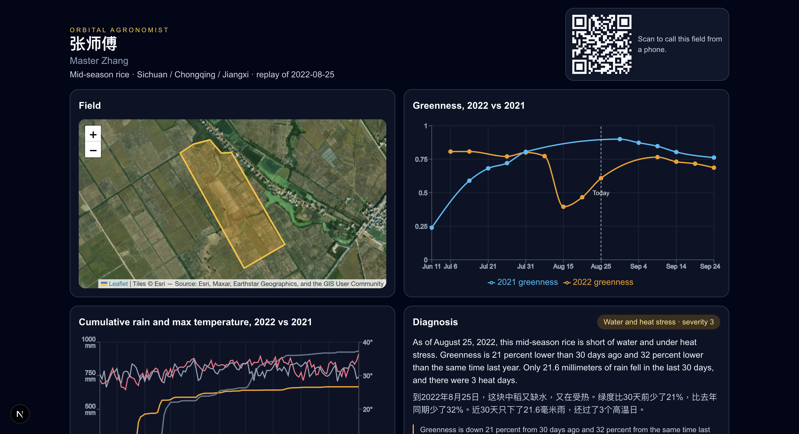
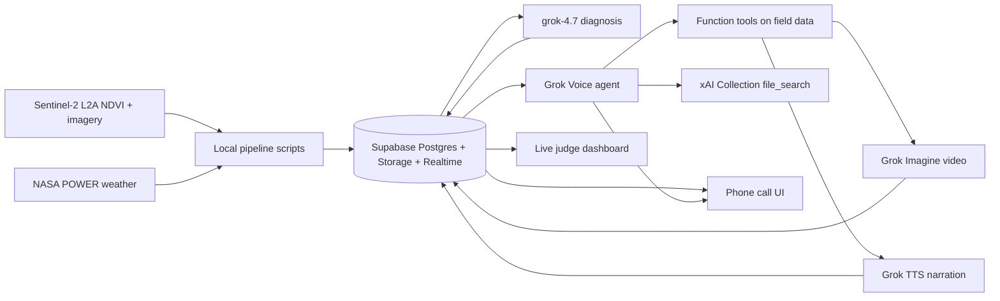

# Orbital Agronomist

Nearly 500 million of the world’s ~570 million farms are smallholders under 2 ha; their crops supply about 16% of global crop-derived dietary energy (FAO, *The State of Food and Agriculture 2025* — an older, widely cited figure of ~35% of world food is not the same statistic). Those farms still get less digital advice than large operations: only 24–37% of farms under 1 ha have 3G/4G coverage, versus 74–80% of farms over 200 ha (Mehrabi et al., *Nature Sustainability*, 2020). Orbital Agronomist is a **voice hotline** that turns real Sentinel-2 greenness and NASA POWER weather for one field into spoken advice in the farmer’s language, then sends a short illustrated clip — replayed here for the 2022 Yangtze-basin drought and heatwave, when Jiangxi reported 505,900 ha of crops affected and 51,200 ha of total crop failure (Caixin, citing the Jiangxi Flood Control and Drought Relief Headquarters; that footprint is all crops, not rice only). The demo farmer is fictional; the satellite and weather series are real.

**Live:** [https://orbital-agronomist.vercel.app](https://orbital-agronomist.vercel.app) — open the dashboard on a laptop, scan the QR (or append `?demo=1` on the call URL) to take the English or Mandarin call on a phone.



## Architecture



## How each Grok product is used

| Product | Role |
|---|---|
| **grok-4.7** | Offline diagnosis: structured advice grounded in the farm’s NDVI, rainfall, and heat numbers (not free invention). Cursor Agent also used grok-4.7 to write the app. |
| **Grok Voice Agent API** | Realtime bilingual hotline (`zh` / `en`). Greets the farmer, calls tools, barges in, logs the transcript. |
| **Function tools** | Field NDVI, weather, diagnosis, and clip send — over the stored series for that polygon, not a generic chatbot. |
| **xAI Collection `file_search`** | IRRI Rice Knowledge Bank and FAO drought/heat documents; the agent cites the source (e.g. IRRI “Rice feels the heat”). |
| **Grok Imagine** | Silent guidance videos for irrigation timing, flowering-field priority, and heat-stress foliar spray. |
| **Grok TTS** | ~10 s narration of each clip in Mandarin (ara) and English (celeste), played with the video on the phone. |

## How we used Cursor

The whole codebase was written in Cursor (eligibility: built with Cursor). Scoring evidence:

| Measure | Count | Where |
|---|---|---|
| Commits on `master` | **19** (including this README) | `git log` |
| Always-on rules file | **1** | `.cursor/rules/project.mdc` |
| Agents run in parallel | **3** (diagnosis/dashboard, voice/clips, voice polish) | [`docs/evidence/08-cursor-three-parallel-agents.png`](docs/evidence/08-cursor-three-parallel-agents.png) |
| Per-task log lines | **20** | [`docs/CURSOR_LOG.md`](docs/CURSOR_LOG.md) |

Other evidence of Agent work: scaffold and satellite table ([`01`](docs/evidence/01-cursor-phase0-scaffold-commits.png), [`02`](docs/evidence/02-cursor-phase1-satellite-data-table.png)), scope change ([`03`](docs/evidence/03-cursor-agentA-scope-change.png)), voice E2E ([`04`](docs/evidence/04-cursor-agentB-voice-e2e.png)), Imagine clips and narration ([`10`](docs/evidence/10-cursor-agentB-imagine-clips.png), [`13`](docs/evidence/13-cursor-agentB-narration-delivery.png)), dashboard ([`11`](docs/evidence/11-cursor-agentA-diagnosis-v2-dashboard.png), [`14`](docs/evidence/14-dashboard-v1.png)), voice polish and literature ([`12`](docs/evidence/12-cursor-agentC-voice-polish.png), [`17`](docs/evidence/17-cursor-agentC-literature-grounding.png)).

## Planned with Grok Bot

A Grok **Mission Planner** bot held the checklist, routines, status log, and research (FAO / Jiangxi / connectivity facts above). Screenshots: [`06` checklist](docs/evidence/06-grokbot-mission-planner-checklist.png), [`07` status and research](docs/evidence/07-grokbot-status-and-research.png), [`15`](docs/evidence/15-grokbot-status-340.png), [`16`](docs/evidence/16-grokbot-status-400.png).

## Data sources

- **ESA Copernicus Sentinel-2 L2A** (NDVI time series and true-color / NDVI stills) via the Copernicus Data Space Ecosystem. Contains modified Copernicus Sentinel data 2021–2022.
- **NASA POWER** (satellite-derived weather and related fields) from the NASA Langley Research Center POWER Project.
- Field polygon drawn for a rice cluster in the Yangtze basin (demo: Yugan County / Jiangxi window). Analysis window 2022-06-01 → 2022-09-30 vs 2021 baseline. Simulated “today” is the last cloud-free observation in mid/late August 2022.

## What we used vs what we built

HackGT / HexLabs Rule 5: AI is a tool, not a reskin. This weekend’s product is the pipeline, diagnosis contract, voice design, clip delivery, and UIs — not a wrapper around a single chat completion.

**Used (third-party):** Next.js, React, TypeScript, Tailwind CSS, Supabase (Postgres, Realtime, Storage), Recharts, Leaflet + react-leaflet, qrcode.react, Vercel, Esri World Imagery basemap; xAI APIs (Grok Voice Agent API, Grok Imagine video, Grok TTS, grok-4.7); ESA Copernicus Sentinel-2 L2A; NASA POWER; [xai-cookbook](https://github.com/xai-org/xai-cookbook/tree/main/voice-examples/agent/web) web voice example as a reference for browser audio handling; Cursor (Agent with grok-4.7); Grok Bot for planning.

**Built this weekend:** the satellite + weather data pipeline (cloud-masked NDVI time series, baseline comparison, derived stress metrics); the grounded diagnosis step (grok-4.7 with structured output restricted to input numbers); the voice agent design (persona, function tools over real field data, bilingual flow, scripted greeting, barge-in, transcript logging); the clip pipeline (Imagine video + TTS narration per language, stored in Supabase); the phone UI and live judge dashboard with Realtime sync; the database schema.

## Credits

Public frameworks and APIs used, per HackGT / HexLabs Rule 4:

Next.js, React, TypeScript, Tailwind CSS, Supabase, Recharts, Leaflet, react-leaflet, qrcode.react, Vercel, Esri World Imagery; xAI (Grok Voice, Imagine, TTS, grok-4.7, Collections); ESA Copernicus / Copernicus Data Space Ecosystem; NASA POWER / NASA Langley Research Center; xAI cookbook voice web example; Cursor; Grok Bot.

## Setup

Requires Node 20+, an xAI API key, Copernicus Data Space OAuth (scripts only), and a Supabase project with `supabase/migrations/0001_init.sql` applied and a public `clips` bucket.

```bash
cp .env.example .env.local
# fill XAI_API_KEY, CDSE_*, NEXT_PUBLIC_SUPABASE_*, SUPABASE_SECRET_KEY
npm install
npx tsx scripts/fetch-ndvi.ts --farm cn-rice-2022
npx tsx scripts/fetch-weather.ts --farm cn-rice-2022
npx tsx scripts/build-farm.ts --farm cn-rice-2022
npx tsx scripts/diagnose.ts --farm cn-rice-2022
npx tsx scripts/generate-clips.ts --farm cn-rice-2022
npx tsx scripts/seed-supabase.ts
npm run dev
```

Open [http://localhost:3000](http://localhost:3000). Do not commit `.env.local`. On Vercel set `XAI_API_KEY` and the three Supabase variables (`CDSE_*` are not needed at runtime). Call URLs may use `?demo=1` to force stored clips.

Build phases and farm config live in [`docs/PLAN.md`](docs/PLAN.md). Challenge mapping is in [`docs/CHALLENGE.md`](docs/CHALLENGE.md).

## Limitations and ethics

- **张师傅 (Master Zhang) is fictional.** The product is a replay of a real 2022 event on a real polygon, not a live advisory service for a named person.
- **Data is historical.** Sentinel-2 and NASA POWER series cover June–September 2022 (baseline 2021). The agent’s “today” is the last clear late-August 2022 scene, not the wall clock.
- **Guidance is general.** Irrigation, field priority, and heat-stress notes are public-extension style, grounded in the numbers and in IRRI/FAO literature. They are not a site-specific agronomic prescription, pesticide recommendation, or substitute for a local extension officer.
- **Voice on phones needs HTTPS** (Vercel) and a microphone permission the user can grant or skip by typing.
- **Live Imagine generation is not awaited on Vercel**; the demo delivers pregenerated clips so the call stays within platform time limits.
